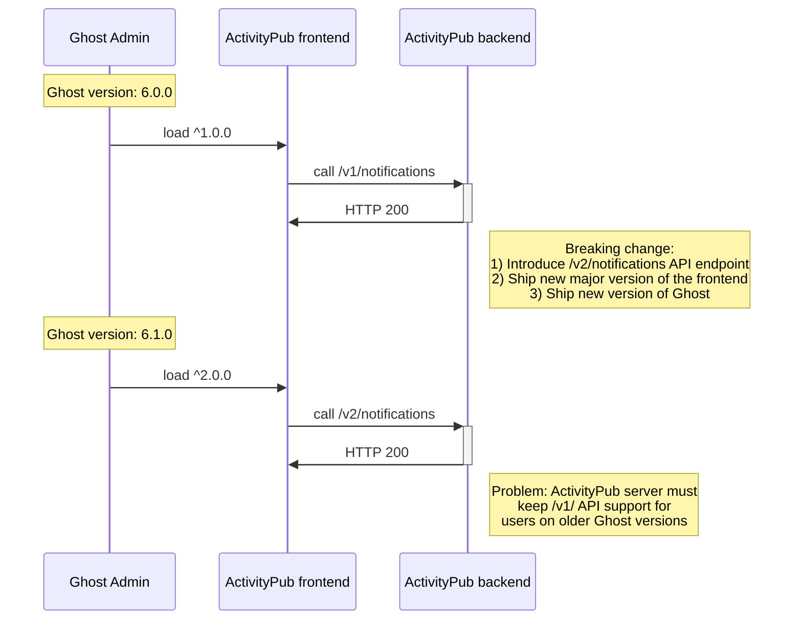
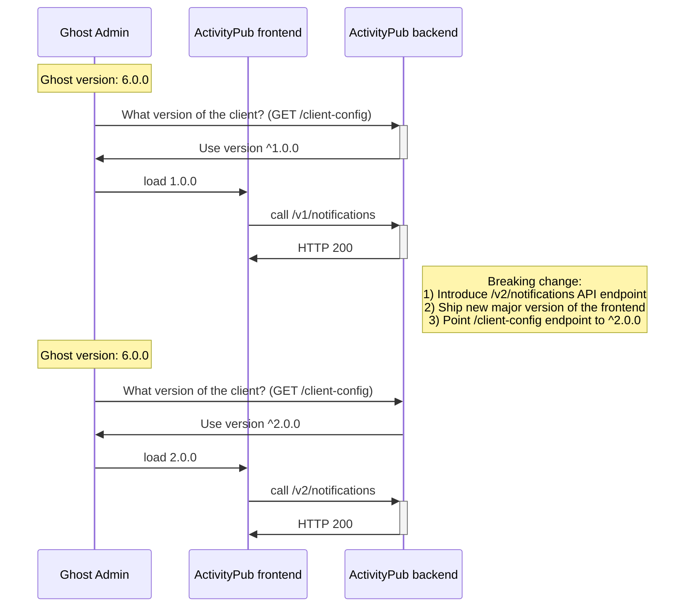

# Frontend/backend versioning

## Status

Approved

## Context

We have an ActivityPub service with multiple deployment scenarios that creates version compatibility challenges.

### Current Architecture
- Ghost Admin defines which version of ActivityPub frontend app to load (from jsDelivr CDN)
- ActivityPub frontend consumes versioned API endpoints (e.g. `/.ghost/activitypub/v1/*`) from the ActivityPub backend
- Ghost Admin, ActivityPub frontend and ActivityPub backend are released independently




### Deployment Scenarios

1. **Ghost Pro hosted**: Users always run the latest backend and frontend versions
2. **Self-hosted with proxy**: Users proxy to our infrastructure (latest backend) but may have older Ghost versions (older frontend loader)
3. **Self-hosted with Docker**: Users run specific backend versions in Docker containers and may have older Ghost versions


### Problem

When we make breaking changes to the backend API, we risk breaking functionality for users who are on older versions of Ghost. This means that we have to keep supporting older versions of the backend API almost indefinitely.

### Requirements
- We cannot dynamically configure client-side built code with environment variables
- We want to avoid maintaining multiple API versions in the same codebase (e.g., `/v1`, `/v2` code duplication)
- We want to minimize infrastructure costs (running multiple backend versions is wasteful)
- The JS bundle loader that imports the frontend is already deployed and cached on various Ghost installations

## Decision

Implement a backend-driven frontend configuration endpoint that tells the JS bundle loader which frontend version to load.

### Implementation
1. Add a new endpoint: `/.ghost/activitypub/stable/client-config`
2. This endpoint returns the CDN URL for the frontend version that is compatible with the backend:
   ```json
   {
      "client": {
         "name": "activitypub",
         "version": "^1.0.0",
         "cdnUrl": "https://cdn.jsdelivr.net/ghost/activitypub@1/dist/activitypub.js"
      }
   }
   ```
3. The JS bundle loader:
   - Calls this configuration endpoint when initializing
   - Dynamically imports the JS bundle from the URL provided by the backend
   - Uses the imported bundle to render the frontend




Now, the ActivityPub backend does not need to support multiple versions of the API endpoints indefinitely. The ActivityPub frontend version is determined by the current ActivityPub backend version (instead of the current Ghost version).

### Release process for breaking changes

1. Ship new version of a backend API endpoint (e.g. `/v2/feed`) with the breaking changes
2. Ship new major of the frontend app (e.g. `2.0.0`), that consumes the new API endpoint
3. Point `/client-config` endpoint to the new major version of the frontend app (`^2.0.0`)

On page refresh, users will load version `^2.0.0` of the frontend app, that is compatible with the new API endpoint. Users with an old tab open will receive a HTTP 410 Gone from the backend when visiting an outdated API endpoint:
```
{
	"message": "Version v1 is not supported.",
	"code": "INVALID_VERSION",
	"requestedVersion": "v1",
	"supportedVersions": [
		"v2"
	]
}
```

Based on that response, the frontend app will render a message asking the user to refresh their page, so that they can load the latest version.


## Consequences

**Positive:**
- **Guaranteed compatibility**: Frontend and backend versions are always compatible, eliminating version mismatch issues
- **Simple mental model**: Each backend version declares which frontend it works with
- **No code duplication**: No need to maintain multiple API versions in the codebase
- **Minimal changes**: Only need to add one endpoint and update the JS loader
- **Flexible versioning**: Can pin to major versions for stability or specific versions when needed
- **Self-contained**: Each deployment scenario works independently without special cases

**Negative:**
- **Additional HTTP request**: The loader must make a request to get the bundle URL before importing (minimal latency impact)
- **CDN dependency**: Requires frontend versions to remain available on CDN (already true for current architecture)
- **Coordinated releases**: When making breaking changes, frontend must be published before backend can require it

**Neutral:**
- Self-hosted users with Docker containers will need to update their containers to get new features (already true, just makes the coupling explicit)
- Users cannot mix and match incompatible frontend/backend versions (this is intentional for stability)
