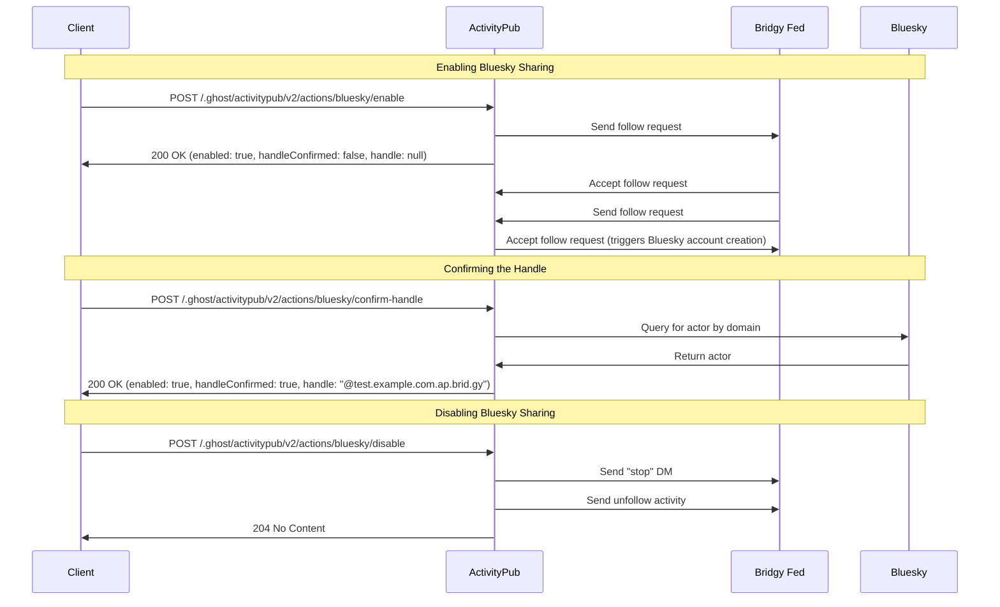

# Bluesky Sharing

## Overview

The Bluesky sharing feature enables Ghost sites to publish content to Bluesky
via [Bridgy Fed](https://fed.brid.gy/) - a bridge service that connects
ActivityPub accounts to the Bluesky network

## Enabling Bluesky Sharing

To enable Bluesky sharing for a site, the client should make an empty POST
request to:

```
/.ghost/activitypub/v2/actions/bluesky/enable
```

This will return a `200 OK` response with the following body:

```json
{
    "enabled": true,
    "handleConfirmed": false,
    "handle": null
}
```

At this point, Bluesky sharing is enabled for the site **BUT** the handle used
for the Bluesky account is not yet known - Bridgy Fed will follow the site's
ActivityPub account and create the Bluesky account. This is an asynchronous 
process which means we do not know the exact handle used for the Bluesky account.
Bridgy Fed determines the handle used for the Bluesky account based on the site's
domain setup. The logic for this is complex so we do not try and compute the handle
on our side. We instead wait for Bridgy Fed to create the Bluesky account and
then we manually confirm the handle used for the Bluesky account by making an
empty POST request to:

```
/.ghost/activitypub/v2/actions/bluesky/confirm-handle
```

This will return a `200 OK` response with the following body:

```json
{
    "enabled": true,
    "handleConfirmed": false,
    "handle": null
}
```

The "waiting" period should be short and is facilitated by the client - the client
should poll the endpoint periodically until the handle is confirmed. Once the handle
is confirmed, a response of `200 OK` will be returned with the following body:

```json
{
    "enabled": true,
    "handleConfirmed": true,
    "handle": "@test.example.com.ap.brid.gy"
}
```

The `/.ghost/activitypub/v1/account/me` endpoint will return information 
regarding the status of the Bluesky sharing feature:

```json
{
    "blueskyEnabled": true,
    "blueskyHandleConfirmed": true,
    "blueskyHandle": "@test.example.com.ap.brid.gy"
}
```

## Disabling Bluesky Sharing

To disable Bluesky sharing for a site, the client should make an empty POST
request to:

```
/.ghost/activitypub/v2/actions/bluesky/disable
```

This will return a `204 No Content` response with an empty body

## Notes

- The handle confirmation process is done by querying the Bluesky API for the
handle using the domain of the site's ActivityPub account when a request is made
to the `/.ghost/activitypub/v2/actions/bluesky/confirm-handle` endpoint
    - i.e. `https://public.api.bsky.app/xrpc/app.bsky.actor.searchActors?q=activitypub.ghost.org`
- All endpoints are idempotent and safe to retry
- Calling `/enable` when already enabled returns the current status
- Calling `/disable` when already disabled succeeds with no changes
- If `/confirm-handle` is called before Bridgy Fed's follow-back completes, it 
  returns a `400 Bad Request` with the message "Bluesky integration not enabled"
- The process can be visualised as follows:

